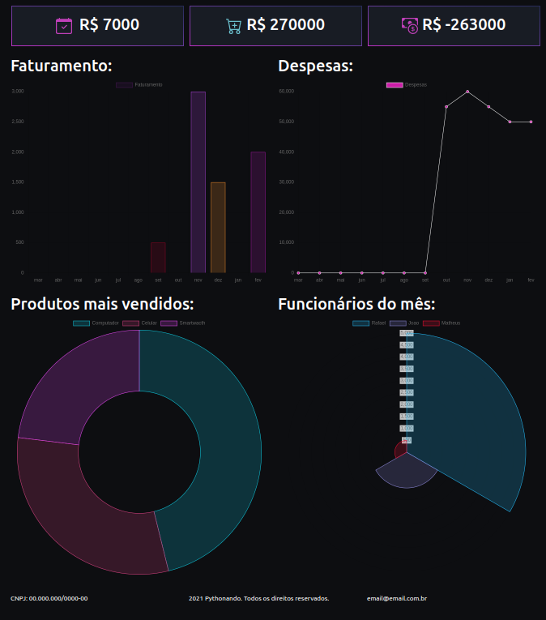

# Sell Dashboard 
## _Project of Study  implementation of dashboard using Django_

This project have created with the purpose to studying creating Dashboards using Django, following the tips of chanel on youtube Pythorando.

This project use Django framework to prove all tooling from web development aplication and also use the database sqlite3 to persist in memory all metadata to be consumption by front end aplication.

We also used [charts.js](https://www.chartjs.org/) js and [bootstrap css](https://getbootstrap.com/docs/3.4/css/) to setup behaviors and apperance front-end layer.

## _Run project_
To run up this project is necessary from root project directory install all dependences with de command:
    ``pip install -r requirements.txt``
The next step should be generate and update all database information to be able run the application:
    ``python3 manage.py makemigrations.`` and
    ``python3 manage.py makemigrate.``
After this step only necessáry execute the command:
    ``python3 manage.py runserver.``

